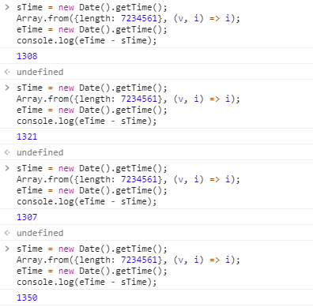
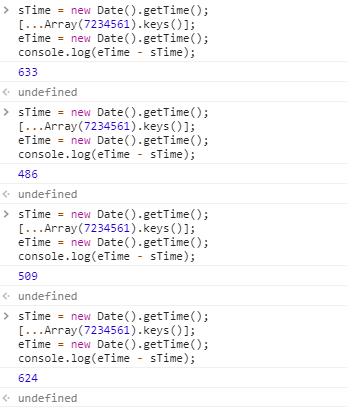

# 数组

## 基本方法

### 遍历

for
```js
const arr = ['w', 'y', 'k', 'o', 'p'];
for(let i = 0, len = arr.length; i < len; i+=1) {
  console.log(arr[i]);
}
```

forEach
```js
const arr = ['w', 'y', 'k', 'o', 'p'];
arr.forEach((v) => {
  console.log(v);
});
```

for of
```js
const arr = ['w', 'y', 'k', 'o', 'p'];
const eArr = arr[Symbol.iterator]();
for (let letter of eArr) {
  console.log(letter);
}
```

### 处理数组

map
```js

```

### 过滤

filter 传入函数，对数组每一个元素进行判断，返回符合条件元素（数组）

### 查询


#### 是否存在一个元素


indexOf

lastIndexOf


find

findIndex


includes 传入具体需要查询的数据，如果包含就返回true反之为false


every 数组的每一项都通过验证返回true，否者返回false

some 需要有一项通过验证即可返回true


## 具体事例

### 创建指定长度的数组

如果我们要创建长度为2的空数组
常用一下方式

```js
const a = [];
a.length = 2;
console.log(a); // [empty × 2]

Array(2); // [empty × 2]
```

```js
Array.from({length: 2}); // [undefined, undefined]

[...Array(2)]; // [undefined, undefined]

Array(2).fill(undefined); // [undefined, undefined]
```

```js
Array.from({length: 5}, (v, i) => i); // [0, 1, 2, 3, 4]
[...Array(5).keys()]; // [0, 1, 2, 3, 4]
```
`Array.from`相当于两步操作 初始化+遍历

经过测试，初始数组为`[0, 1, 2, 3, ...]`这类数组，第二种性能会较好

`Array.from`方式



解构赋值方式




### 生成二维空数组

解构赋值+map方式
```js
[...Array(5)].map(v => []);
```

直接fill方式
```js
const arr = Array(5).fill([]);
```
注意在这种方式下，如果修改`arr[0][1] = 1`，其他所有项都会同步，所以这种方式是不合适的。


### 数组合并不去重
```js
// 使用 concat，不能去除重复值
function merge(...args) {
  return [].concat(...args)
}
// ES6，同样不能去除重复值
array1 = [...array1, ...array2]
```

### 数组去重合并

单一数组去重
可以使用Set数据结构
```js
const set = new Set([1, 1, 2, 2]); // [1, 2]
Object.prototype.toString.call(set); // [object Set]
```
注意此处返回的是Set格式的数据结构，如果需要使用Array，需要使用`Array.from(set)`更改为Array

多个数组合并去重
```js
function combine(...arg){ 
  let arr = [].concat.apply([], arg);  //没有去重复的新数组 
  return Array.from(new Set(arr));
} 
var m = [1, 2, 2], n = [2,3,3], l = [4, 2, 2]; 
console.log(combine(m, n, l));                     // [1, 2, 3, 4]
```
### 类数组对象转化为真正的JavaScript数组
```js
// Native
Array.prototype.slice.call(arrayLike);
// ES6-way
Array.from(arrayLike);
```
