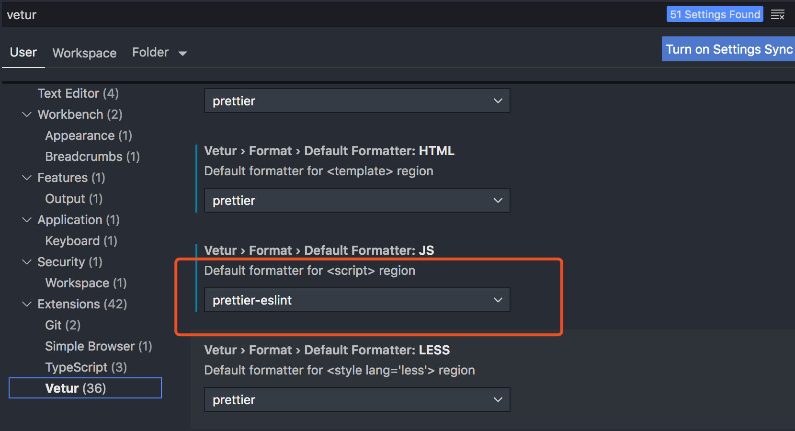

# vscode


## 我的应用

Auto Close Tag 
自动闭合标签

Auto Raname Tag
同步修改标签

Beautify
格式化代码

Chinese
中文

Css Compressor
css压缩

ESlint

GitLens

One Dark Pro
配色

Prettier - Code formatter

Vetur


## vue 配置


安装插件
eslint，prettier，vetur


```
"[vue]": {
"editor.defaultFormatter": "octref.vetur"
},
"vetur.format.defaultFormatter.html": "prettier",
"vetur.format.defaultFormatter.js": "prettier-eslint",
"editor.formatOnSave": true,
"editor.tabSize": 2,
"javascript.preferences.quoteStyle": "single",
"prettier.singleQuote": true
```


### 格式化代码时，没有根据eslint格式

加入配置

```
  "editor.codeActionsOnSave": {
    "source.fixAll.eslint": true
  }
```

如果发现格式化两次，说明刚刚以上配置和`"editor.formatOnSave": true`,注释即可。

### 出现的问题
有时候出现保存vue文件时，自动保存格式化时，js中单引号 格式成双引号
针对以上问题，可以在配置文件中加入`"vetur.format.defaultFormatter.js": "prettier-eslint"`

