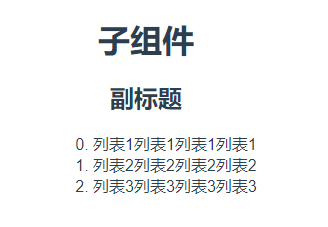

# 数据传递

## 父组件向子组件
父组件向子组件传递主要通过Prop，在父层级修改相关的数据，也会显示到子组件中。


<CodeGroup>
  <CodeGroupItem title="父组件" active>

```vue
<template>
  <div>
    <Child title="子组件" :title2="top"  :list="arr"></Child>
  </div>
</template>
<script>
import Child from './Child';
export default {
  name: 'Parent',
  components: {Child},
  data() {
    return {
      top: '副标题',
      arr: ['列表1列表1列表1列表1', '列表2列表2列表2列表2', '列表3列表3列表3列表3'],
    }
  }
}
</script>
```
  </CodeGroupItem>
  <CodeGroupItem title="子组件" >

```vue
<template>
  <div>
    <h1>{{title}}</h1>
    <h2>{{title2}}</h2>
    <ul>
      <li v-for="(item, index) in list" :key="index +1">{{index}}. {{item}}</li>
    </ul>
  </div>
</template>
<script>
export default {
  name: 'Child',
  props: {
    title: String,
    title2: String,
    list: Array
  },
}
</script>
```
  </CodeGroupItem>
</CodeGroup>


最终展示效果如下


在以上代码中，父组件引入了子组件，并通过以下形式传递
```html
<Child title="子组件" :title2="top"  :list="arr"></Child>
```
title是静态属性，直接传递的是`子组件`,而`:title2`和`:list`是动态的值
实际是传递是是data中的数据
```js
data() {
  return {
    top: '副标题',
    arr: ['列表1列表1列表1列表1', '列表2列表2列表2列表2', '列表3列表3列表3列表3'],
  }
}
```

在子组件中，通过props接受数据，键是接收的变量名称，值是约定参数类型
```js
props: {
  title: String,
  title2: String,
  list: Array
}
```
以上子组件就可以拿到数据了

## 子组件向父组件

### 方式一

所有的 prop 都使得其父子 prop 之间形成了一个单向下行绑定：父级 prop 的更新会向下流动到子组件中，但是反过来则不行。这样会防止从子组件意外改变父级组件的状态，从而导致你的应用的数据流向难以理解。
额外的，每次父级组件发生更新时，子组件中所有的 prop 都将会刷新为最新的值。这意味着你不应该在一个子组件内部改变 prop。如果你这样做了，Vue 会在浏览器的控制台中发出警告
所以要修改子组件的显示发数据，是需要在父组件中修改。子组件可以进行事件的派发，而父组件对派发是事件进行监听即可。


<CodeGroup>
  <CodeGroupItem title="父组件" active>

```vue
<template>
  <div>
    <Child :num="number" v-on:add-num="addNum"></Child>
  </div>
</template>
<script>
import Child from './Child';
export default {
  name: 'Parent',
  components: {Child},
  data() {
    return {
      number: 1,
    }
  },
  methods: {
    addNum() {
      this.number++
    }
  }
}
</script>
```
  </CodeGroupItem>
  <CodeGroupItem title="子组件" >

```vue
<template>
  <div>
    <h1>{{num}}</h1>
    <button @click="$emit('add-num')">+1</button>
  </div>
</template>
<script>
export default {
  name: 'Child',
  props: {
    num: Number,
  },
}
</script>
```
  </CodeGroupItem>
</CodeGroup>


以上代码中number数据通过prop传递给子组件，子组件中有个按钮，点击按钮需要对数据递增，因为数据是父组件的数据，所以修改的方式也要在父组件中完成。
父组件中添加事件的监听`add-num`，监听到事件触发`methods`中`addNum`方法
```html
<Child :num="number" v-on:add-num="addNum"></Child>
```

子组件中进行触发
```html
<button @click="$emit('add-num')">+1</button>
```

如果需要给触发的事件传递参数，可以在子组件中修改成如下方式
```html
<button @click="$emit('add-num', 1, 1)">+1</button>
```
父组件处理函数，直接可以进行接受
```js
addNum(num1, num2) {
  console.log(num1, num2); // 1 1
}
```


### 方式二
以上方式，父组件通过prop传递了事件'add-num'，其实传递也是可以的，可以直接采用
```
this.$parent.$emit('add-num')
```
写法就变成以下这种

<CodeGroup>
  <CodeGroupItem title="父组件" active>

```vue
<template>
  <div>
    <Child :num="number"></Child>
  </div>
</template>
<script>
import Child from './Child';
export default {
  name: 'Parent',
  components: {Child},
  data() {
    return {
      number: 1,
    }
  },
  methods: {
    addNum() {
      this.number = this.number + num1 + num2;
    },
    addListener() {
      this.$on('add-num', this.addNum);
    }
  },
  mounted() {
    this.addListener();
  }
}
</script>
```
  </CodeGroupItem>
  <CodeGroupItem title="子组件" >

```vue
<template>
  <div>
    <h1>{{num}}</h1>
    <button @click="clickHandle">+1</button>
  </div>
</template>
<script>
export default {
  name: 'Child',
  props: {
    num: Number,
  },
  methods: {
    clickHandle() {
      this.$parent.$emit('add-num', 1, 1);
    }
  }
}
</script>
```
  </CodeGroupItem>
</CodeGroup>


这个方式比较适合，多个组件都需触发一个事件，就不需要父组件将方法一个一个传入了。

### 方式三

以上两种方式，都可以将子组件内部的数据传递出去。
接下来这种方式，主要是在子组件中将从父组件中的传递过来的数据直接修改

父组件在向下传递参数的时候，带上了修饰符`.sync`
在子组件中 `this.$emit('update:isShow', newValue)`，可以直接修改 `childIsShow`的值。


<CodeGroup>
  <CodeGroupItem title="父组件" active>

```vue
<template>
  <div>
    <Child :isShow.sync="childIsShow"></Child>
  </div>
</template>
<script>
import Child from './Child';
export default {
  name: 'Parent',
  components: {Child},
  data() {
    return {
      childIsShow: false,
    }
  },
  methods: {
  },
  mounted() {
  }
}
</script>
```
  </CodeGroupItem>
  <CodeGroupItem title="子组件" >

```vue
<template>
  <div>
    <h1>{{num}}</h1>
    <button @click="clickHandle">{{isShow}}</button>
  </div>
</template>
<script>
export default {
  name: 'Child',
  props: {
    isShow: Boolean,
  },
  methods: {
    clickHandle() {
      this.$emit('update:isShow', !isShow)
    }
  }
}
</script>
```
  </CodeGroupItem>
</CodeGroup>


## 越级向下传递数据
`provide` / `inject`
这对选项需要一起使用，以允许一个祖先组件向其所有子孙后代注入一个依赖，不论组件层次有多深，并在起上下游关系成立的时间里始终生效。

> `provide` 和 `inject` 主要为高阶插件/组件库提供用例。并不推荐直接用于应用程序代码中。

```js
// 父级组件提供 'foo'
var Provider = {
  provide: {
    foo: 'bar'
  },
  // ...
}
// 子组件注入 'foo'
var Child = {
  inject: ['foo'],
  created () {
    console.log(this.foo) // => "bar"
  }
  // ...
}
```

## 多层级组件触发
element 对事件进行了封装，用mixins混入，可以无限向上根据组件名称冒泡查询，也可以向下查询，所有的组件都可以共用这个方法，截取的代码如下


emitter.js
```js
function broadcast(componentName, eventName, params) {
  this.$children.forEach((child) => {
    const name = child.$options.componentName;

    if (name === componentName) {
      child.$emit(...[eventName].concat(params));
    } else {
      broadcast.apply(child, [componentName, eventName].concat([params]));
    }
  });
}

/**
 * 用于vue组件的mixins
 * @minxin
 */
export default {
  methods: {
    /**
     * 向父组件派发事件
     * @param {String} componentName 子组件componentName
     * @param {String} eventName 触发的事件名称
     * @param {Array} params 传递的数据
     */
    dispatch(componentName, eventName, params) {
      let parent = this.$parent || this.$root;
      let name = parent.$options.componentName;

      while (parent && (!name || name !== componentName)) {
        parent = parent.$parent;

        if (parent) {
          name = parent.$options.componentName;
        }
      }
      if (parent) {
        parent.$emit(...[eventName].concat(params));
      }
    },
    /**
     * 向子组件派发事件
     * @param {String} componentName 子组件componentName
     * @param {String} eventName 触发的事件名称
     * @param {Array} params 传递的数据
     */
    broadcast(componentName, eventName, params) {
      broadcast.call(this, componentName, eventName, params);
    },
  },
};
```

总体代码再次修改成如下方式


<CodeGroup>
  <CodeGroupItem title="父组件" active>

```vue
<template>
  <div>
    <Child :num="number"></Child>
  </div>
</template>
<script>
import Child from './Child';
export default {
  name: 'Parent',
  componentName: 'Parent',
  components: {Child},
  data() {
    return {
      number: 1,
    }
  },
  methods: {
    addNum(num1, num2) {
      this.number = this.number + num1 + num2;
    },
    addListener() {
      this.$on('add-num', this.addNum)
    }
  },
  mounted() {
    this.addListener();
  }
}
</script>
```
  </CodeGroupItem>
  <CodeGroupItem title="子组件" >

```vue
<template>
  <div>
    <h1>{{num}}</h1>
    <button @click="clickHandle">+1</button>
  </div>
</template>
<script>
import emitter from 'emitter';

export default {
  name: 'Child',
  componentName: 'Child',
  props: {
    num: Number,
  },
  mixins: [emitter],
  methods: {
    clickHandle() {
      this.dispatch('Parent', 'add-num', [1, 1]);
    }
  }
}
</script>
```
  </CodeGroupItem>
</CodeGroup>

